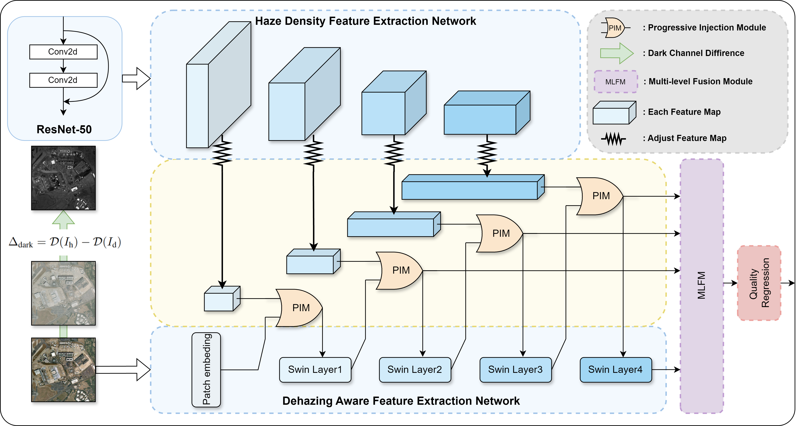

# DCPI-DQA

Source codes for paper “Dark Channel Difference Driven Dehazed Image Quality Assessment with Progressive Injection”


## Installation

Install Requirements

```bash
csv
argparse
random
numpy
scipy
torch
torchvision
timm
```

## Datasets
[DHQ](https://www.terabox.com/chinese/sharing/link?surl=uK-uwnqHgOdj67y7JAC2Gg)

[SHRQ](https://www.terabox.com/chinese/sharing/link?surl=8Cu2qUHGH7BuRnJvzj0ioA)

[exBeDDE](https://drive.google.com/file/d/1swAyQS-j9QNTvLwsCJgbFXnjscB86CeL/view)

## Usage

### train and test DCPI-DQA

```bash
Python3 train_and_test.py
```

If you want to switch the dataset or hyper-parameter, you can modify the parameters as follows

```bash
python train_and_test.py --help
```

Follow the given prompts to select the parameters you need. For example:

```bash
python train_and_test.py --dataset DHQ --patch_num 25 --batch_size 64 --lr 2e-5 --epochs 6
```


